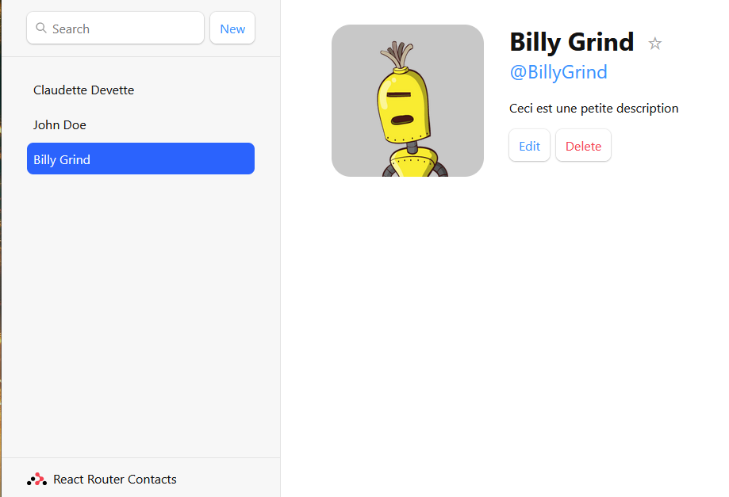
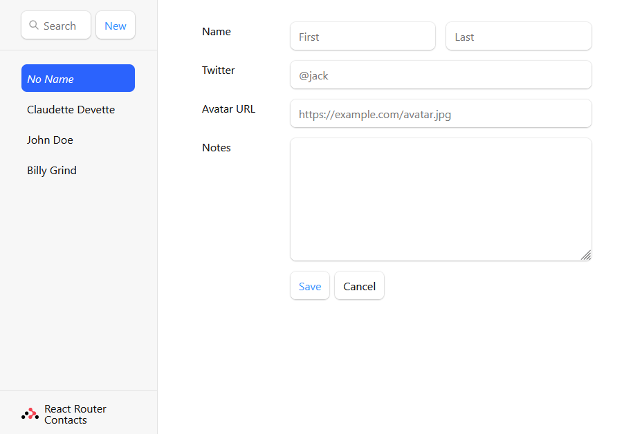
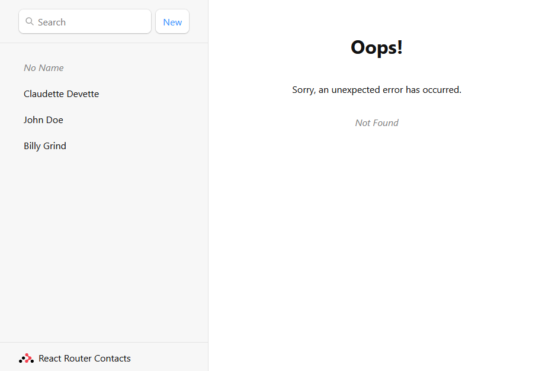

# Tuto_React_Router

## Tutoriel de Découverte de React Router avec Vite

Ce projet est basé sur le tutoriel officiel de React Router et utilise Vite comme outil de développement. L'objectif principal est de construire une application simple de gestion de contacts en utilisant React Router pour la navigation.

## Installation

1. Clonez ce dépôt : `git clone https://github.com/BillyGrind/Tuto_React_Router`
2. Accédez au répertoire du projet : `cd tutoreactrouter`
3. Installez les dépendances : `npm install`
4. Lancez l'application : `npm run dev`

Assurez-vous d'avoir Node.js et npm installés localement.

## Tutoriel Utilisé

Ce projet suit le tutoriel officiel de React Router. Vous pouvez trouver le tutoriel complet [ici](https://reactrouter.com/en/main/start/tutorial).

## Fonctionnalités

- Affichage d'une liste de contacts.
- Barre de recherche pour filtrer les contacts.
- Affichage individuel de chaque contact avec la possibilité de les éditer et de les supprimer.
- Création d'un nouveau contact.
- Page d'erreur pour les URL invalides.

## Captures d'écran

*Fig. 1 : Capture d'écran montrant la vue d'un contact individuel.*

*Fig. 2 : Capture d'écran du formulaire de création d'un nouveau contact.*

*Fig. 3 : Capture d'écran montrant la page d'erreur pour les URL invalides.*

## Utilisation d'Images de Profil

Pour utiliser des images de profil, vous pouvez visiter le site [Gravatar URL Generator](https://vinicius73.github.io/gravatar-url-generator/#/) pour générer des URLs d'images de profil Gravatar.

## Contributeurs

- [@BillyGrind](https://github.com/BillyGrind)

